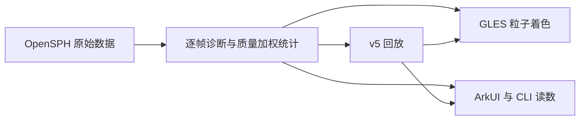

# SPH 诊断与接入路线

> 类型：当前参考；适用版本：0.30.0；实现／验证日期：2026-09-07（Asia/Shanghai）。

## 这一步解决什么

沿用 [覆盖审计](UPSTREAM-AUDIT.md) 的“物理可观察性 → 自引力基线 → 碰撞模式连接”顺序。这一版让已有岩质求解结果从原生 Storage 进入粒子着色、ArkUI、语义 CLI、时间轴和回放。它落实 [博客与论坛路线](../research/UNIVERSE-SANDBOX-BLOG-FORUM-2026-09-07.md) 的可测量实验方向，没有添加自引力或借用同行私有代码。



## 来源与单位

固定核心提交仍为 `f3033faf4422a056dcb79cc6643c7c6f3d9fee19`。当前运行路径为 Tillotson 玄武岩、VonMises 强度和 ScalarGradyKipp 损伤；默认压力及固体应力项，没有自引力。源字段定义见 [QuantityIds](../../third_party/opensph/core/quantities/QuantityIds.h)，有效损伤的使用见 [Rheology](../../third_party/opensph/core/physics/Rheology.cpp)。

| 原始量 | 转换 | 输出 |
| --- | --- | --- |
| PRESSURE，Pa | 除以 10⁹ | 有符号 GPa，最小／最大／质量加权均值 |
| ENERGY，比内能 J/kg | 除以 10⁶ | MJ/kg，最小／最大／质量加权均值 |
| DAMAGE，标量立方根 | root³ | 0–1 有效损伤，最大／质量加权均值 |
| MASS 与 POSITION 一阶导数 | Σ½m·v²、Σm·u | 总动能 J、总内能 J |

损伤显示必须立方：上游在屈服和负压退化中用 root³。接入层只容忍根值边界 10⁻⁹ 的浮点舍入，超界或非有限数据明确失败；不悄悄改造明显无效数据。均值为 Σm·x/Σm，保留原始双精度，最后仅处理落在极值边界的舍入。每粒子的显示标量单独转为 float，不反向影响求解数据。

读出的是求解器当前 Storage 中保留的压力，没有另行在绘图时重新计算状态方程。初始帧、选中历史帧与最新帧均保留对应统计。比内能不是温度；材料损伤不是碎片谱。内能和动能尚未包含弹性应变能，也没有引力势能，不能宣称完整能量守恒诊断。

## 实现与兼容

[提取与回放](../../entry/src/main/cpp/engine.cpp) 调用 [诊断聚合](../../entry/src/main/cpp/sph_diagnostics.h)，通过 [N-API](../../entry/src/main/cpp/napi_init.cpp) 提供读取。[页面](../../entry/src/main/ets/pages/Index.ets) 的按钮与 CLI 共用动作，颜色保存到实验配方；操作说明见 [CLI](../CLI.md#sph-碰撞诊断)。

回放 v5 保留 v2 的 SPH 配置块与每帧原有 24 字节粒子记录，在每帧末尾追加十个 double 汇总和每粒子三个 float。顺序为压力最小／最大／均值，比内能最小／最大／均值，损伤均值／最大，动能／内能。增加字节数为每帧 80 + 12×实际粒子数，240 帧、实际 2400 粒子的示例约增加 6.61 MiB；预算与实际粒子数可能不同。历史仍限 240 帧，载入仍限每帧 10000 粒子。渲染另使用单帧诊断缓冲，没有引入整段历史的 ArkTS 粒子拷贝。

v1/v2 SPH 回放不补造数据；v3/v4 轨道布局不变，只有这些版本读取轨迹附加块。损坏、非有限汇总、超界损伤和截断文件在替换当前场景前被拒绝。旧应用不能读 v5 或新颜色配方。回放仍是可视化快照，不能从历史帧续算。

打开面板时，SPH 与既有近看构图共用可见区域及平滑过渡；SPH 按区域与视口的短边比例缩放位置和粒子尺寸。关闭面板恢复完整构图，不改相机姿态、求解状态、帧选择或原生表面。矮窗口中的长读数面板仍需滚动。

## 验证与复现

[原生单位测试](../../tests/sph_diagnostics_test.cpp) 用不等质量和有符号压力检查单位、加权和 damage³，并检查 NaN、越界与累积溢出。[原生回归](../../tests/engine_smoke.cpp) 验证三种实际 SPH 实验、v5 精确回读、v1/v2 缺失语义、损坏文件原子拒绝及原轨道 v3/v4；不是拿界面截图替代物理数据。

```sh
node --test tests/*.test.mjs
clang++ -std=c++17 -I entry/src/main/cpp tests/sph_diagnostics_test.cpp -o /tmp/opensph-diagnostic-test
/tmp/opensph-diagnostic-test
./scripts/test-emulator.sh 127.0.0.1:5555
node scripts/test-sph-diagnostics-emulator.mjs 127.0.0.1:5555
node scripts/test-sph-layout-emulator.mjs 127.0.0.1:5555
```

模拟器脚本会切换实验和窗口，执行前需保存正在使用的实验。原生回放测试写入独立测试目录，不覆盖应用回放槽。所有本轮证据见 [0.28.0 记录](../releases/RELEASE-0.28.0.md)。

桌面对照的 [独立提取程序](../../tests/sph_reference.cpp) 直接运行 IRun 并读取 Storage，不引用应用 Engine 或诊断聚合类。三类初值与应用一致：预算 200、10 秒、种子 1234、目标半径 100 km、撞击体 60 km、密度 2700 kg/m³；正碰／掠碰速度 5 km/s，掠碰 45°；自转实验角速度 0.006 rad/s。实际粒子数为 212／212／210。

macOS 当前 libc++ 要求随机访问迭代器提供 operator[]，因此只在临时核心副本应用 [兼容补丁](../evidence/sph-0.28.0-desktop-iterator.patch)，不修改应用导入内核。可在项目根目录复现：

```sh
reference_dir=$(mktemp -d /tmp/opensph-reference.XXXXXX)
cp -R third_party/opensph "$reference_dir/source"
patch -d "$reference_dir/source" -p0 < docs/evidence/sph-0.28.0-desktop-iterator.patch
cmake -S "$reference_dir/source" -B "$reference_dir/build" -G Ninja -DCMAKE_BUILD_TYPE=Release
cmake --build "$reference_dir/build" -j 6
clang++ -std=c++14 -O3 -DNDEBUG -I "$reference_dir/source/core" tests/sph_reference.cpp "$reference_dir/build/core/libcore.a" -pthread -o "$reference_dir/reference"
"$reference_dir/reference" > "$reference_dir/reference.jsonl"
```

[桌面数据](../evidence/sph-0.28.0-desktop-reference.jsonl) 与 [真实鸿蒙数据](../evidence/sph-0.28.0-emulator.json) 中三类终态逐项对比，误差定义为 |设备−桌面|/max(1,|桌面|)，阈值 10⁻⁸；[最大实测误差约 1.32×10⁻¹⁵](../evidence/sph-0.28.0-desktop-comparison.json)。这是同一固定物理模型的跨平台和独立提取对照，不是独立物理模型验证，也不代表所有分辨率、全部上游模块或真实天体均已验证。

可使用 [数值对比工具](../../scripts/compare-sph-reference.mjs) 重新生成报告；工具还检查初始配置、秒单位、案例完整性、粒子数、时间和总质量，任何字段缺失或误差超限都会失败：

```sh
node scripts/compare-sph-reference.mjs docs/evidence/sph-0.28.0-desktop-reference.jsonl docs/evidence/sph-0.28.0-emulator.json
```

## 后续顺序与验收门槛

1. 已完成：压力／比内能／损伤贯通、同初值桌面对照和旧回放兼容。
2. 0.29.0 已接入五项曲线、采样极值定位与全部十项 CSV 导出；跨实验叠加及真实物理事件识别仍待做。0.30.0 新增 [材料极限与固定时间步敏感性基线](SPH-BASELINE.md)、两组粒子预算主题和曲线入口；损伤与分辨率尚未收敛。下一步仍需标准冲击和弹性算例、更多空间分辨率与独立参考解。先确认能量预算中缺少的弹性项，不能简单用动能加内能作误差百分比。
3. 自引力：在固定配置下增加球体稳定与双体基线，核对直接引力和树近似、软化长度及势能；通过误差验证后再开放再聚集实验。当前没有引力开关。
4. 模型连接：先定义轨道近接触到局部 SPH 的质量、质心、动量和单位转换，再做双天体局部实验入口；回到长时轨道前需要碎片定义与稳定 ID，不能把视觉粒子组当成新行星。
5. 真机规模：记录实际内存、计算耗时、持续温控与交互延迟，再确定手机／平板／电脑的预算。月球形成、完整热力学、多材料和全宇宙交互仍属后续工作。
