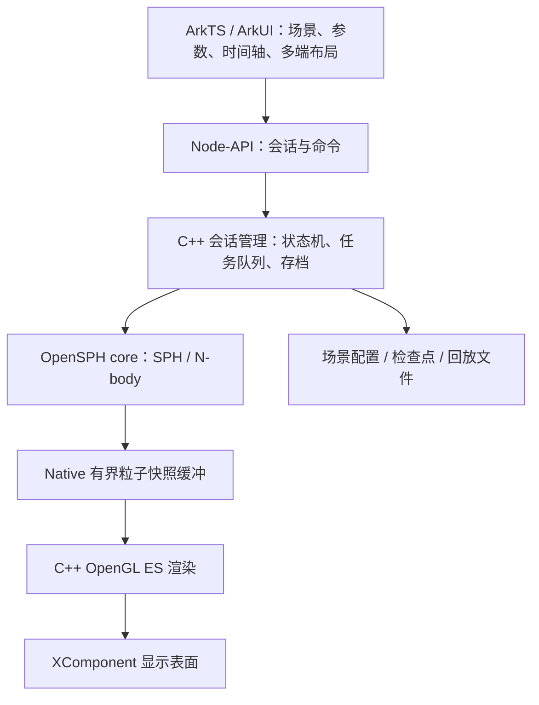

# OpenSPH 鸿蒙移植调研与实施方案

> 类型：调研快照；适用范围：历史方案。
> 调研日期：2026-09-06；整理日期：2026-09-06（Asia/Shanghai）。

本文保留当时的判断、限制和操作记录，可能已被后续版本替代。请先阅读[当前文档目录](../../README.md)。

调研日期：2026-09-06。结论：基于现有 ARM 适配重建 ArkTS/ArkUI 应用层，保留 OpenSPH C++ 求解器，建立独立 Native 控制与渲染层。SpaceSim 作为易用性和功能参考。

## 1. 已找到的工程与证据

本地根目录：`/Users/jiexuanyang/Doubao/chats/2026-08-27/new-chat/opensph-port`。

| 位置 | 已核实内容 | 后续用途 |
| --- | --- | --- |
| `OpenSPH/` | 上游源码及未提交适配；HEAD 为 `f3033faf4422a056dcb79cc6643c7c6f3d9fee19` | 提取内核和 ARM 补丁，先清点未提交改动 |
| `OpenSPH-DevEco/` | QAbility + Qt-OH + wxWidgets；module.json5 声明 tablet、2in1 | 保留历史桌面基线，整理资源、打包经验 |
| `OpenSPH-DevEco-arkts-backup/` | ArkTS 启动页调用 startOpenSPH，桥接代码 dlopen 启动桌面程序 | 不是现成原生仿真界面；只参考基础工程结构 |
| `publish/` | Git 远端指向 joinother/OpenSPH-HarmonyOS，工作区干净；本地最新提交 `8b4230e`，日期 2026-08-27 | 后续新架构的版本管理起点 |
| `sse2neon.h`、patches、tools/i18n | SSE→NEON、鸿蒙构建和汉化成果 | 按模块筛选复用 |

远端：[joinother/OpenSPH-HarmonyOS](https://github.com/joinother/OpenSPH-HarmonyOS)。通过 GitHub MCP 实际读取了 README 和 CLI 指南；尚未逐文件比对本地与远端，不能断言完全同步。

现有二进制 `OpenSPH-DevEco/entry/libs/arm64-v8a/libopensph.so` 的动态依赖仍含 Qt6Test 和多个 wxWidgets 库，RUNPATH 还带本机构建路径。它是桌面应用加载产物，不是供 ArkTS 操作粒子和仿真生命周期的独立 SDK。

已确认本机有 DevEco Studio 和 OpenHarmony SDK 20。首次 hdc 查询因本机网络访问受限返回 `Connect server failed`；用户提示模拟器已开启后，获准本机网络访问并成功连接 `127.0.0.1:5555`。模拟器报告设备类型 `phone`、API 24。查询 `com.opensph.app` 未取得包信息，尚不能据此判定其他包名下是否有相关应用。本次没有重新构建、安装或完成真机性能测试。

## 2. OpenSPH 与 SpaceSim

[OpenSPH 上游](https://github.com/pavelsevecek/OpenSPH)是 C++ SPH/N-body 库及科学仿真桌面应用，支持天体撞击、材料响应、破碎和引力计算。[LICENSE](https://github.com/pavelsevecek/OpenSPH/blob/master/LICENSE)明确为 MIT，允许修改、分发和商业使用，要求保留版权及许可声明。第三方依赖和素材分别核对许可。

这里的 SpaceSim 指 Pavel Ševeček 开发的 [SpaceSim – Astrophysical Simulation Software](https://store.steampowered.com/app/4055380/SpaceSim__Astrophysical_Simulation_Software/)，并非其他同名网站或航天器系统仿真软件。[作者主页](https://pavelsevecek.github.io/)明确其使用 OpenSPH 求解器，并提供更直观的界面。

本次未找到 SpaceSim 应用本体的公开源码仓库或开源授权；按照不可直接复用其私有实现的产品处理。OpenSPH 的 MIT 授权不自动覆盖 SpaceSim 的新增代码、界面和素材。

建议参考的产品能力：对象参数编辑、预设场景、物理量着色、模拟历史回放、镜头跟踪。自行实现界面与资源。其 CPU/GPU 双求解器、光线步进和复杂导出功能不能视为 OpenSPH 开源版本直接具备的可移植能力。官方也明确这是非实时模拟器，大规模计算可能耗时数小时；移动端不能承诺同等规模实时运行。

## 3. 推荐架构

这是架构提案，尚未实现。华为官方支持 [ArkTS 与 C++ 的 Node-API 交互](https://developer.huawei.com/consumer/cn/doc/harmonyos-guides/use-napi-process)及 [XComponent Native 渲染](https://developer.huawei.com/consumer/cn/doc/harmonyos-guides/napi-xcomponent-guidelines)。

ArkTS 负责应用流程、表单、帮助、设置、文件选择、设备布局及交互；C++ 负责粒子数组、邻域搜索、积分、引力和材料方程。每帧大量粒子留在 Native，ArkTS 只接收低频统计与选中对象数据。不要每帧把整个粒子系统序列化成 JSON。

使用独立求解线程和渲染线程，有界双缓冲或三缓冲处理快照。UI 发命令，求解线程在安全步边界应用；运行中修改初始条件需明确重建场景或创建分支。按 Node-API 线程约束投递通知，不能在任意 C++ 线程直接使用绑定其他线程的 napi_env。

建议会话接口：createSession、loadScene、start、pause、resume、cancel、updateParameters、getStatistics、saveCheckpoint、loadCheckpoint、destroySession。它们是待实现的接口，不是当前仓库已有 API。状态至少包括 Ready、Running、Paused、Completed、Cancelled、Failed。

回放与继续计算分开：回放帧可只含可视化数据；检查点必须保存足以恢复求解的状态、材料、积分器信息、随机种子和版本。空间单位内部统一，UI 支持 km、地球质量等单位并转换。计算精度先维持可靠基线，显示采用相对相机坐标后再转 float，不能为提速全局改成单精度。

## 4. 内核拆分的具体工作

已查到 core 的 CMake 单独生成静态库，直接 include 搜索未发现 core 中引用 wx 或 gui 头文件。这支持先尝试仅构建 core，但不构成完整依赖与运行验证。

1. 为无 GUI 构建设置独立入口或开关。上游顶层强制 find_package(wxWidgets)，并添加 gui 子目录，不能照搬顶层构建；同时去掉不适合 ARM 交叉编译的 x86 编译参数。
2. 初期关闭 TBB、Eigen、ChaiScript、OpenVDB 等可选依赖，使用已有线程池；真实依赖以构建结果确认。上游 CMake 的 WITH_TBB 默认值为 ON，与 README 的默认线程池描述存在差异，以固定版本源码为准。
3. 复用已有 Vector.h 的 sse2neon 适配，补 SIMD 数值对比与对齐检查；以后依据热点分析决定是否改写 NEON。
4. core 静态库启用 PIC，链接成真正的 Native 共享库，检查动态依赖和打包搜索路径，目标是不携带 Qt/wxWidgets。
5. 审计文件系统、线程、计时、异常、进程与路径相关实现，文件全部通过实际应用沙箱路径访问。
6. 复用 CLI 的配置读取和任务组织思路，移除面向整个进程的 exit 行为，变成会话级返回与错误处理。现有 [CLI 指南](https://github.com/joinother/OpenSPH-HarmonyOS/blob/main/docs/cli-guide.md)说明其仍从 QAbility/App::OnInit 进入，运行结束退出；默认全局参数也尚未全部从工程加载。

## 5. 第一版产品与设备策略

首版流程：选实验 → 调质量、速度、角度等少量参数 → 运行/暂停 → 查看结果和物理量 → 保存与回放。建议三个实验：双体轨道、小行星碰撞、简化行星环。科学术语提供通俗说明、单位、合理默认值及参数范围。

| 设备/窗口 | 界面安排 | 算力策略 |
| --- | --- | --- |
| 手机窄窗口 | 主视口 + 底部操作条，属性抽屉 | 低规模真实计算，预计算示例，温控降档 |
| 平板中窗口 | 视口 + 单侧属性栏，触控优先 | 中等规模，支持分屏与横竖切换 |
| 鸿蒙电脑宽窗口 | 对象树 + 视口 + 属性栏 + 时间轴 | 键鼠、快捷键、大窗口与更高预算 |

布局依据窗口尺寸，而非仅依据设备型号。华为[电脑适配指南](https://developer.huawei.com/consumer/cn/doc/best-practices/bpta-pc-guide)支持核心功能一致时采用统一 HAP，差异显著时拆分；本项目优先共享模块及统一 HAP，按实际 SDK 的 deviceTypes 与能力声明适配。

这里的电脑首先指鸿蒙电脑。Windows、macOS、Android、iOS 不会自动运行同一个鸿蒙 HAP；若未来要覆盖它们，可继续复用 C++ 内核，另做对应前端。

不提前承诺粒子上限。可用 1k、5k、10k 等粒子阶梯作为测试点，分别记录求解耗时、渲染帧率、内存、温度和长时间降频。30 FPS 可作为低档渲染目标，物理计算进度单独显示；动态降低渲染负载时不随意改变仿真的物理参数。需要降低求解分辨率时向用户明确说明并重建场景。

预计算内容明确标为回放，使低性能设备离线也可学习。远程计算属于后续可选扩展，需要独立服务、作业管理与成本设计，不把它作为首版必需条件。

## 6. 实施顺序与验收

| 阶段 | 交付 | 通过条件 |
| --- | --- | --- |
| P0 基线整理 | 固定上游 SHA、清点本地变更、拆分 ARM/平台/GUI 补丁、最小 native 构建 | 无 Qt/wx 依赖的 core 构建；最小数值实验通过 |
| P1 纵向打通 | ArkTS 页面、会话接口、一个真实仿真、XComponent 视口 | 加载、开始、暂停、取消可用，求解不阻塞 UI |
| P2 易用原型 | 三个实验、参数解释、着色、存档与回放 | 同配置可复现；回放与检查点语义清楚 |
| P3 多端适配 | 手机/平板/鸿蒙电脑布局与性能档 | 真机横竖屏、自由窗口、触控键鼠和持续负载验证 |
| P4 分发准备 | 依赖许可清单、签名发布包、完整构建说明 | 干净环境可复现，安装升级及数据保留验证 |

数值验收：双体轨道守恒误差与时间步收敛、SPH 标准算例与固定桌面基线比较、NEON 与参考实现误差、确定性种子重跑、检查点恢复一致性。误差阈值按场景和基线明确，不能用“画面正常”替代。

工程验收：反复创建销毁会话、暂停恢复、取消长任务、后台/前台切换、Surface 重建、长时间内存稳定。手机不能假设退到后台仍可无限执行计算，默认暂停并保存可恢复状态，额外后台策略另查系统能力。

首版延后：GPU 物理解算、黑洞引力透镜、Lua 扩展、百万粒子、OpenVDB/Alembic 导出和复杂视频管线。先让真实仿真、交互和跨设备稳定性成立，再逐项扩展。

## 7. MCP 的实际作用与当前边界

- 鸿蒙开发者知识 MCP 已成功调用 searchDocuments 和 getDocumentsById，取回 Node-API、XComponent 和电脑多端适配官方资料。适合持续核验 API、版本约束、构建与性能方案。
- GitHub MCP 已定位远端并读取文档，适合后续核对源码、管理提交与评审。
- MCP 是开发辅助能力，不是 SPH 求解器，也不代替 DevEco 编译、hdc 安装与真机测试。
- 本次完成源码与二进制检查和方案调研，没有重写现有项目或发布新版本；尚无三端实测性能结论。

建议下一开发任务直接定为：在独立工作副本中实现“无 Qt/wx 的 OpenSPH core + ArkTS 控制一个真实实验 + XComponent 显示”的最小闭环。成功后再扩展完整多端产品，能最早暴露决定移植成败的技术问题。
